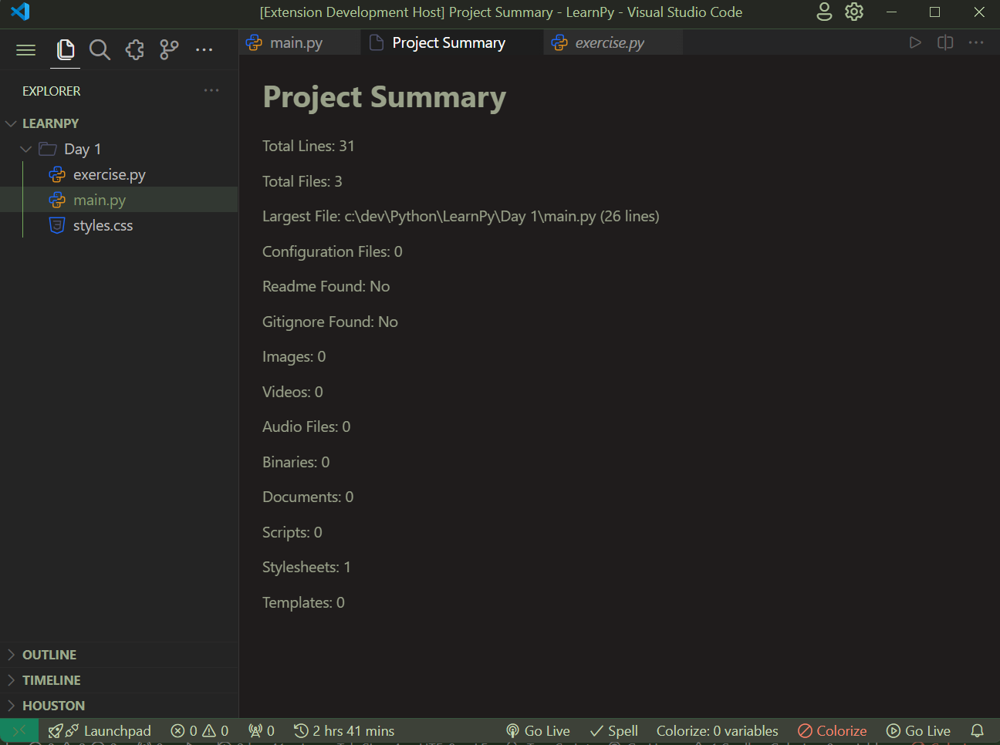
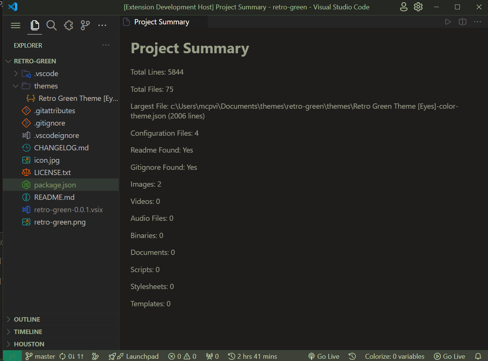

# Project Summary

Project Summary is a Visual Studio Code extension that displays a summary of the current project.

## Features

- Shows the total number of lines of code.
- Shows the total number of files in the project.
- Shows the largest file in the project.
- Shows the libraries used in the project.
- Shows the number of configuration files in the project.
- Indicates whether a README file is found in the project.
- Indicates whether a .gitignore file is found in the project.
- Shows the number of images, videos, audio files, binaries, documents, scripts, stylesheets, and templates in the project.

## Usage

1. Open a project.
2. Run the command `Show Project Summary` from the command palette.

## Installation

1. Clone the repository.
2. Run `npm install` to install dependencies.
3. Open the project in VS Code and press `F5` to open a new VS Code window with the extension loaded.

## Supported File Types

- Images: JPG, JPEG, PNG, GIF, SVG
- Videos: MP4, MOV, AVI, MKV
- Audio: MP3, WAV, FLAC, AAC
- Binaries: EXE, DLL, SO
- Documents: DOC, DOCX, PDF, XLS, XLSX, PPT, PPTX
- Scripts: JS, TS
- Stylesheets: CSS, SCSS, LESS
- Templates: HTML, EJS, Pug

## Supported Projects

This extension is useful for developers working on various types of projects, including:

- Web development projects
- Desktop application development
- Mobile application development
- Data science projects
- Game development projects

## Screenshots

